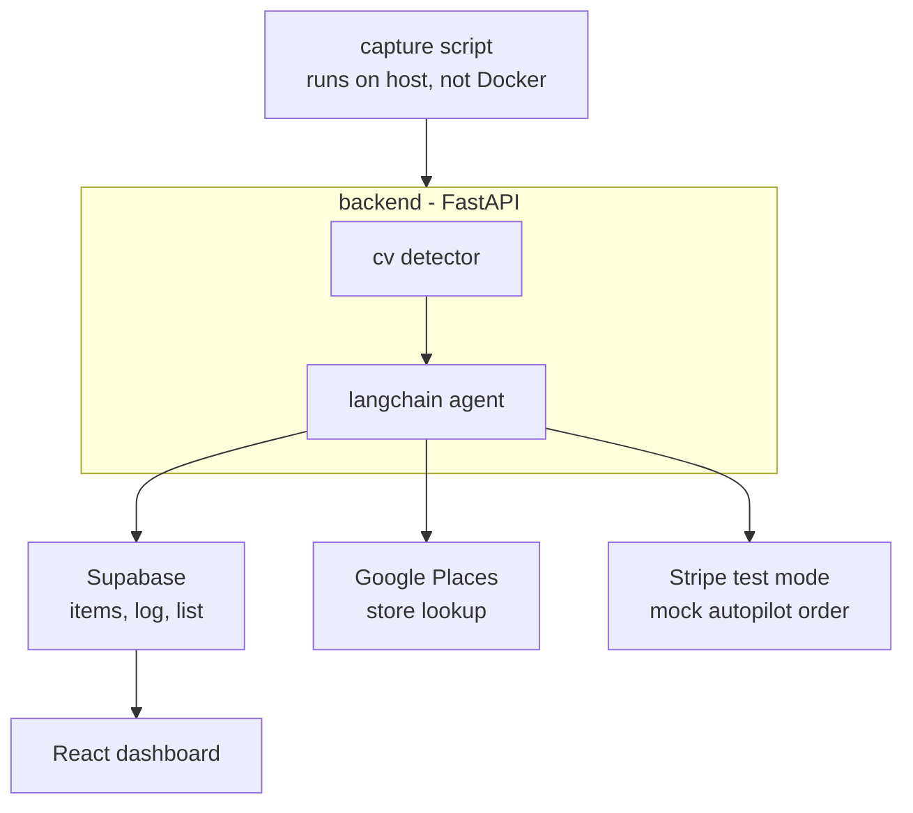

# last-one-agent

An agentic fridge/pantry inventory tracker built for the Agentic AI Hackathon 2026.

A webcam-connected capture script feeds a pretrained CV model that detects items
removed from the fridge. A LangChain agent decides what to do about it — either
suggest the nearest store that has the item, or autonomously place a mock order,
based on a user-configurable autonomy toggle. Over time, it learns consumption
pace to time its reminders accurately.

## Project structure

| Folder | What it does |
|---|---|
| `frontend/` | React dashboard — live inventory, shopping list, autonomy toggle |
| `backend/` | FastAPI hub — imports `agent/` and `cv/` as packages, talks to Supabase |
| `agent/` | LangChain agent — decides what to do, calls tools (list, store lookup, order, notify) |
| `cv/` | Pretrained detector (YOLO-World) — turns webcam frames into item counts |
| `capture/` | Webcam capture script — runs on the host machine, not in Docker |
| `supabase/` | `schema.sql` — reference for database tables, not a deployed service |

## Architecture



## Setup

1. Copy `.env.example` to `.env` and fill in:
   - `SUPABASE_URL`, `SUPABASE_KEY`
   - your LLM provider API key
   - `GOOGLE_PLACES_API_KEY`
   - `STRIPE_SECRET_KEY`, `STRIPE_PUBLISHABLE_KEY`
2. Run `docker-compose up` — this starts the frontend and backend together
3. Separately, run the capture script locally (it needs real webcam access,
   so it isn't containerized):
```bash
   cd capture
   pip install -r requirements.txt
   python webcam_capture.py
```

## Database (Supabase)

This project uses a single **shared cloud** Supabase project — there is no local
Supabase Docker stack (`supabase start`) in this workflow, everything targets the
real cloud database directly.

### One-time project setup (already done)

This has already been done for the repo, documented here for reference:

```bash
npm install supabase --save-dev
npx supabase init
```

This links the repo to our shared cloud Supabase project. Again: we do **not** run
`supabase start` or use the local dev stack — migrations are pushed straight to
the cloud project.

### Setup for writing your own migrations (optional)

You only need this if you're going to add or change tables yourself. If you're
just running the app, skip to "Just running the app" below.

```bash
npx supabase login
npx supabase link --project-ref <project-ref>
```

- `npx supabase login` authenticates the CLI with your own Supabase account.
- Everyone links to the **same** `<project-ref>` — the shared project. Find it in
  the dashboard under **Project Settings → General → Reference ID**, or as the
  subdomain in `SUPABASE_URL` (e.g. `https://<project-ref>.supabase.co`).

### Creating a migration

When you need to add or change a table:

```bash
npx supabase migration new <descriptive_name>
```

- This creates a timestamped SQL file in `supabase/migrations/`.
- Write your `CREATE TABLE` / `ALTER TABLE` statements in that file.
- Apply it to the real cloud database:

```bash
npx supabase db push
```

- Commit the migration file to git so the team has a shared history of schema
  changes.

### Just running the app

Running the backend/frontend does **not** require any of the CLI setup above —
that's only needed if you're changing the schema. To just run the app, copy
`.env.example` to `.env` and fill in `SUPABASE_URL` and `SUPABASE_KEY` (the
service_role key) for the shared project.

### Current tables

None yet — the DB schema is still being planned, so `supabase/schema.sql` is
currently empty and there's no `supabase/migrations/` folder. An earlier draft
sketched out `items`, `inventory_log`, and `shopping_list` tables, but that
wasn't final and hasn't been applied to the cloud project. Once the schema is
agreed on, create it with `npx supabase migration new` as described above.

## Ownership

| Folder | Owner |
|---|---|
| `frontend/` | |
| `backend/` | |
| `agent/` | |
| `cv/` | |
| `capture/` | |
| `supabase/` | |
