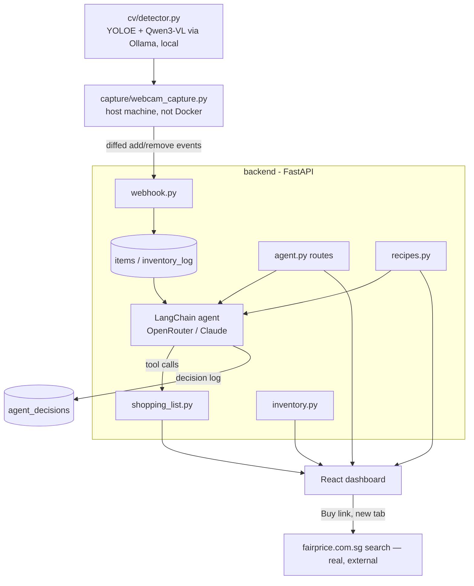

# yoink!

An agentic fridge/pantry assistant built for the Agentic AI Hackathon 2026.

Point a camera at your fridge; a local CV pipeline figures out what's in there.
A LangChain agent (Claude, via OpenRouter) watches consumption pace and expiry
dates, decides what needs restocking, and either **suggests** it or (in
**autopilot**) stages and confirms it for you. A React dashboard shows the
live inventory, an AI-generated shopping list with real FairPrice links per
item, and on-demand recipe suggestions from what's actually in stock.

## What's real vs. what's scoped out

This is a hackathon build — most of it is real, working, end-to-end, but a
few things were deliberately cut for scope. Read this before demoing:

**Real:**
- CV detection (YOLOE + a local Qwen3-VL model via Ollama) turning a photo
  into item names, counts, and confidence — see [`cv/README.md`](cv/README.md)
- Supabase Postgres backing inventory, shopping list, preferences, recipe
  feedback, and a full audit log of every agent decision
- A tool-calling LangChain agent (Claude via OpenRouter) that reasons over
  consumption rate + days-until-depletion + expiry date and decides whether
  to stage an item, "order" it, and/or notify — both per-item and as a
  whole-fridge daily sweep
- LLM-generated recipe suggestions from current stock (prioritizing
  near-expiry items), plus AI-generated recipe photos, plus a separate
  "healthy" mode backed by real TheMealDB lookups
- A conversational "Ask AI" chat about your fridge/recipes
- Per-item "Buy" links on the shopping list that open a real, working
  FairPrice search results page for that item (`fairprice.com.sg/search?query=...`)

**Not real / explicitly out of scope:**
- **No real store/cart integration.** "Buy" opens a FairPrice search page in
  a new tab — it does not add anything to an actual cart. There is no
  RedMart/Instacart/Amazon integration; earlier cart-selection UI for that
  was mock scaffolding and has been removed.
- **No real payment.** Autopilot's "order" and the dashboard's "Purchased"
  action just flip the shopping-list row to `status='purchased'` in the DB.
  No Stripe, no checkout, nothing external.
- **No Google Places integration.** Store lookup was scoped out early; see
  the schema comments in `supabase/migrations/`.
- The CV pipeline needs a webcam and a local Ollama model — it isn't
  containerized and won't run on a machine without both.
- Recipe generation, recipe images, the agent, and chat all need a real
  `OPENROUTER_API_KEY` — without one they fail gracefully (an error message
  in the UI / a logged `error: true`), not with a crash.

## Project structure

| Folder | What it does |
|---|---|
| `frontend/` | React (Vite) dashboard — fridge inventory, shopping list, recipes, chat |
| `backend/` | FastAPI hub — routes for inventory, shopping list, preferences, recipes, agent, webhook; talks to Supabase |
| `agent/` | LangChain agent — per-item + daily-sweep decisions, recipe generation, chat, consumption-rate math |
| `cv/` | YOLOE + local VLM produce detector — turns a fridge photo into item counts (own [README](cv/README.md)) |
| `capture/` | Webcam capture loop — runs on the host machine, not in Docker; diffs frames and posts events to the backend |
| `supabase/` | Migrations — the real, applied schema for the shared cloud Supabase project |

## Architecture



## Setup

1. Copy `.env.example` to `.env` and fill in:
   - `SUPABASE_URL`, `SUPABASE_KEY` — the shared cloud Supabase project (see below)
   - `OPENROUTER_API_KEY` — powers the agent, recipe generation, recipe images, and chat
2. `docker compose up` — starts the frontend (port `5173`) and backend (port `8010`, proxies to container port `8000`)
3. Open `http://localhost:5173`

That covers the dashboard end-to-end against the live shopping list / recipes /
agent. The webcam pipeline is optional and separate:

```bash
cd capture
pip install -r requirements.txt
python webcam_capture.py
```

This needs `cv/`'s own dependencies too (Python 3.12, a local Ollama model)
— see [`cv/README.md`](cv/README.md) for the full 4-step setup, since it's
non-trivial and platform-sensitive.

## Database (Supabase)

This project uses a single **shared cloud** Supabase project — there is no
local Supabase Docker stack (`supabase start`); everything targets the real
cloud database directly.

### Current tables

Applied via `supabase/migrations/`:

- `shelf_life_lookup` — default expiry windows by category
- `items` — the tracked fridge/pantry inventory
- `inventory_log` — add/remove event history per item
- `shopping_list` — staged items; `status` drives `pending → in_cart → purchased`; `store_link` is the FairPrice search URL (generated server-side in `shopping_list.py`, never a real add-to-cart action)
- `preferences` — dietary restrictions / cuisine preferences (single household)
- `recipe_feedback` — thumbs up/down per suggested recipe
- `agent_decisions` — audit log of every agent run: context, tool calls, outcome

### If you need to change the schema

```bash
npx supabase login
npx supabase link --project-ref <project-ref>   # same shared project for everyone
npx supabase migration new <descriptive_name>   # creates a timestamped SQL file
npx supabase db push                             # applies it to the real cloud DB
```

Commit the migration file so the team has a shared history of schema changes.
Just running the app doesn't need any of this — only `SUPABASE_URL`/`SUPABASE_KEY` in `.env`.

## Known issues / things to be aware of before demoing

- The frontend's `node_modules` can go stale relative to `package.json`
  (missing `@fontsource-variable/*` has bitten this before) — if the dev
  server 500s on `main.jsx`, run `npm install` in `frontend/` (and inside
  the container: `docker compose exec frontend npm install`).
- On Windows, Vite's file watcher inside the Docker bind mount can miss host
  edits — if a change isn't showing up, `docker compose restart frontend`.
- Recipe generation / images / agent / chat all silently no-op or show an
  error if `OPENROUTER_API_KEY` is missing — check `docker compose logs backend`
  if the Recipes screen shows "Failed to fetch".
