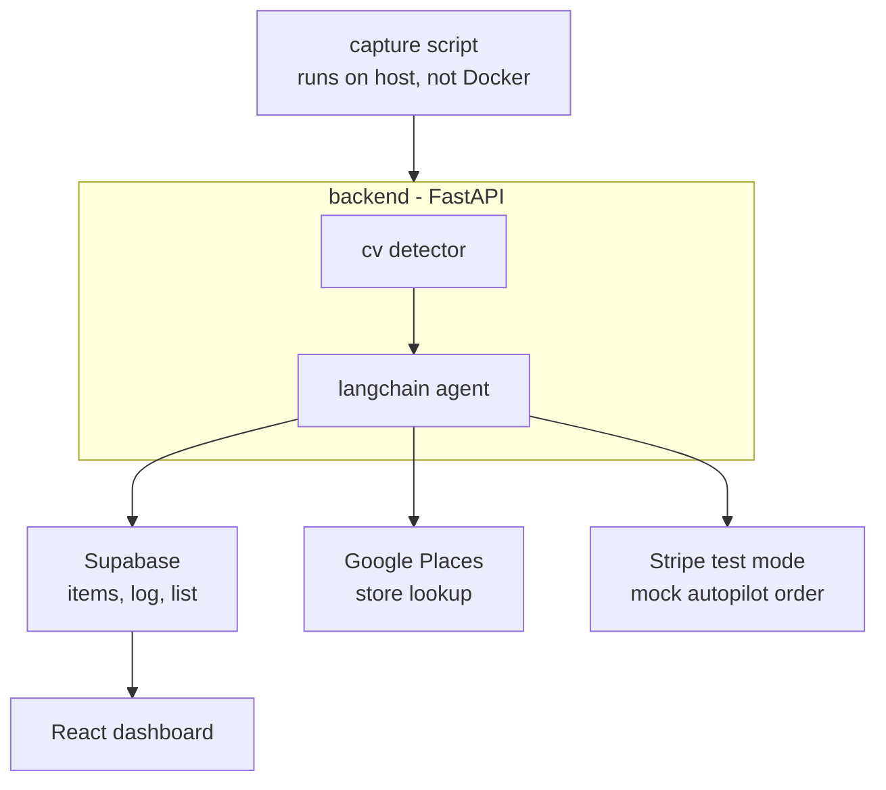

# last-one-agent

An agentic fridge/pantry inventory tracker built for the Agentic AI Hackathon 2026.

A webcam-connected capture script feeds a pretrained CV model that detects items
removed from the fridge. A LangChain agent decides what to do about it — either
suggest the nearest store that has the item, or autonomously place a mock order,
based on a user-configurable autonomy toggle. Over time, it learns consumption
pace to time its reminders accurately.

## Project structure

| Folder | What it does |
|---|---|
| `frontend/` | React dashboard — live inventory, shopping list, autonomy toggle |
| `backend/` | FastAPI hub — imports `agent/` and `cv/` as packages, talks to Supabase |
| `agent/` | LangChain agent — decides what to do, calls tools (list, store lookup, order, notify) |
| `cv/` | Pretrained detector (YOLO-World) — turns webcam frames into item counts |
| `capture/` | Webcam capture script — runs on the host machine, not in Docker |
| `supabase/` | `schema.sql` — reference for database tables, not a deployed service |

## Architecture



## Setup

1. Copy `.env.example` to `.env` and fill in:
   - `SUPABASE_URL`, `SUPABASE_KEY`
   - your LLM provider API key
   - `GOOGLE_PLACES_API_KEY`
   - `STRIPE_SECRET_KEY`, `STRIPE_PUBLISHABLE_KEY`
2. Run `docker-compose up` — this starts the frontend and backend together
3. Separately, run the capture script locally (it needs real webcam access,
   so it isn't containerized):
```bash
   cd capture
   pip install -r requirements.txt
   python webcam_capture.py
```

## Ownership

| Folder | Owner |
|---|---|
| `frontend/` | |
| `backend/` | |
| `agent/` | |
| `cv/` | |
| `capture/` | |
| `supabase/` | |
