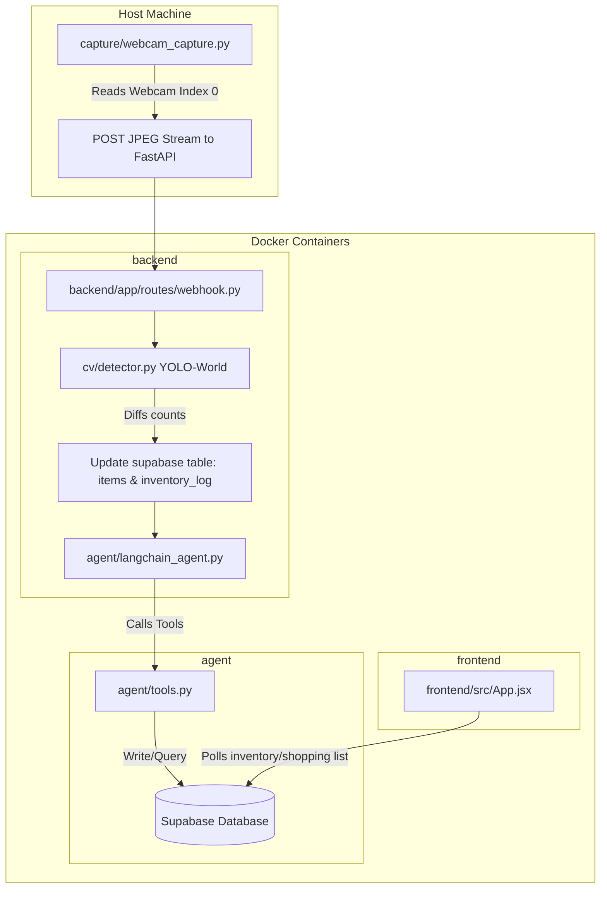

# Codebase Summary: last-one-agent

An agentic fridge/pantry inventory tracker built for the Agentic AI Hackathon 2026. This document acts as a complete guide for an AI developer to fully understand, modify, or extend the codebase.

---

## 1. High-Level Architecture & Data Flow



### Flow description:
1. **Passive Image Capture:** The capture script runs locally on a host machine, reading frames from the webcam, and encoding them into JPEG bytes. It POSTs them continuously (every 2s by default) to the backend.
2. **Object Detection:** The FastAPI webhook endpoint consumes the JPEG byte stream, calling the YOLO-World object detector with predefined class names (like vegetables, dairy, etc.).
3. **Inventory Diffing & Log:** The backend compares the counts of objects in the current frame to the previous stable frame.
   - If an item is added or removed, a log is written to `inventory_log`.
   - The item's active quantity is updated in `items`.
   - If it's a new item, `shelf_life_lookup` is queried to automatically set `expiry_date`.
4. **Agent Activation:** If inventory changes or on a query timer, the LangChain agent executes. It evaluates user settings (autonomy mode: `"suggest"` vs `"autopilot"`) and triggers corresponding tools (adding items to the shopping list, generating local shopping URLs, pushing notifications).
5. **Dashboard Rendering:** The frontend dashboard queries the Supabase database to display live pantry inventory, expiring ingredients, pending/purchased shopping lists, and AI-suggested recipes.

---

## 2. File-by-File Details and Intentions

### **Root Configs**
* **[.env.example](file:///.env.example):** Environment template defining connection variables for Supabase (`SUPABASE_URL`, `SUPABASE_KEY`), LangChain LLM API (`ANTHROPIC_API_KEY`), Google Places API (`GOOGLE_PLACES_API_KEY`), Stripe Payment keys (`STRIPE_SECRET_KEY`, `STRIPE_PUBLISHABLE_KEY`), and Backend API host (`BACKEND_URL`).
* **[docker-compose.yml](file:///docker-compose.yml):** Spins up two containers:
  * `frontend`: Dev server on port `5173`.
  * `backend`: FastAPI dev server (uvicorn) on port `8010` forwarding to container port `8000`.

---

### **Capture Service**
* **[capture/webcam_capture.py](file:///capture/webcam_capture.py):**
  * **Intention:** A standalone Python script that reads the local camera feed (index 0) using OpenCV.
  * **Details:** Runs outside Docker. Uses `cv2.VideoCapture(0)`, encodes the frame as a `.jpg` buffer, and POSTs the raw bytes with a `Content-Type: image/jpeg` header to the backend webhook path `http://localhost:8010/webhook/frame`.

---

### **Computer Vision Module**
* **[cv/detector.py](file:///cv/detector.py):**
  * **Intention:** Wrapper around YOLO-World to run zero-shot real-time object detection.
  * **Details:** Contains the `Detector` class. Instantiates `ultralytics.YOLOWorld` using the `yolov8s-worldv2.pt` model weight file. `set_classes(class_names)` sets labels dynamically. `detect(frame)` performs prediction and returns a label count mapping (e.g. `{"egg carton": 1, "milk carton": 2}`).
* **[cv/test_detector.py](file:///cv/test_detector.py):**
  * **Intention:** A utility test script.
  * **Details:** Loads a dummy image `cv/test_images/before.jpg` and runs the detector wrapper, printing resulting object counts to stdout.

---

### **LangChain Agent**
* **[agent/langchain_agent.py](file:///agent/langchain_agent.py):**
  * **Intention:** Entrypoint for running the shopping and notifications agent.
  * **Details:** Defines `run_agent(item_name, autonomy_mode)`. Since the LLM setup is currently stubbed out (raises `NotImplementedError` in `_get_llm()`), it executes static python branch triggers:
    - `"suggest"` mode: Checks store stock via `check_store_stock` and alerts the user with a notification.
    - `"autopilot"` mode: Autonomously places an order via `place_order` and triggers a confirmation alert.
* **[agent/tools.py](file:///agent/tools.py):**
  * **Intention:** LangChain tools bound to the LLM agent.
  * **Details:**
    - `add_to_shopping_list(item_name)`: Inserts a row into the Supabase `shopping_list` table.
    - `check_store_stock(item_name)`: (Stub) Queries Google Places to find local grocery stores that sell the item.
    - `place_order(item_name)`: (Stub) Calls Stripe checkouts in test mode to order.
    - `send_notification(message)`: (Stub) Sends notification messages to the user (currently print statements).

---

### **FastAPI Backend**
* **[backend/Dockerfile](file:///backend/Dockerfile):** Builds the backend service using `python:3.11-slim` and exposes `8000`.
* **[backend/app/main.py](file:///backend/app/main.py):** Registers API middleware, sets up routes from `inventory` and `webhook`, and runs a `/health` endpoint.
* **[backend/app/db/supabase_client.py](file:///backend/app/db/supabase_client.py):** Instantiates the python `supabase` SDK client using env variables.
* **[backend/app/routes/inventory.py](file:///backend/app/routes/inventory.py):** Endpoint stub at `/inventory` intended to retrieve the current user inventory list.
* **[backend/app/routes/webhook.py](file:///backend/app/routes/webhook.py):** Endpoint stub at `/webhook/frame` that receives raw webcam binary images.

---

### **Supabase Database & Migrations**
* **[supabase/migrations/20260823150120_initial_schema.sql](file:///supabase/migrations/20260823150120_initial_schema.sql):**
  * **shelf_life_lookup:** Reference table mapping category names to typical shelf life durations in days (e.g. `leafy_greens` $\rightarrow$ 5 days).
  * **items:** Active pantry/fridge state representing tracked ingredients, quantities, unit metrics, and `expiry_date`.
  * **inventory_log:** Append-only transaction list tracking addition and removal logs. Essential for consumption-rate telemetry calculations.
  * **shopping_list:** Carts tracked items with status `'pending'`, `'in_cart'`, or `'purchased'`. Also contains store locator search links.
  * **preferences:** Dietary restrictions and cuisine lists to prune AI recipes.
  * **recipe_feedback:** Logs recipe upvotes/downvotes to tailor recommendations.

---

### **Frontend Client**
* **[frontend/Dockerfile](file:///frontend/Dockerfile):** Builds Vite app in a node alpine environment.
* **[frontend/src/App.jsx](file:///frontend/src/App.jsx):** Scaffolds a React entry screen (currently the standard Vite/React template). It needs to be replaced with the actual pantry telemetry UI dashboard.

---

## 3. Database Schema Reference

```
                             +-----------------------+
                             |   SHELF_LIFE_LOOKUP   |
                             +-----------------------+
                             | category (PK - text)  |
                             | typical_days (int)    |
                             | notes (text)          |
                             +-----------+-----------+
                                         |
                                         | categorizes
                                         v
+------------------------+   +-----------+-----------+   +-----------------------+
|     INVENTORY_LOG      |   |         ITEMS         |   |     SHOPPING_LIST     |
+------------------------+   +-----------------------+   +-----------------------+
| id (PK - uuid)         |   | id (PK - uuid)        |   | id (PK - uuid)        |
| item_id (FK - uuid)  <-+---+ item_id (uuid)        +-->+ item_id (FK - uuid)   |
| event_type (text)      |   | category (FK - text)  |   | item_name (text)      |
| quantity_delta (num)   |   | quantity (numeric)    |   | status (text)         |
| detected_at (timestampt)|  | unit (text)           |   | store_link (text)     |
| source (text)          |   | first_detected (time) |   | staged_at (timestamp) |
+------------------------+   | last_seen (time)      |   | confirmed_at (time)   |
                             | expiry_date (date)    |   +-----------------------+
                             | last_notified (time)  |
                             +-----------------------+

+-----------------------------------+        +-----------------------------------+
|            PREFERENCES            |        |          RECIPE_FEEDBACK          |
+-----------------------------------+        +-----------------------------------+
| id (PK - uuid)                    |        | id (PK - uuid)                    |
| dietary_restrictions (text_array) |        | recipe_title (text)               |
| cuisine_preferences (text_array)  |        | liked (boolean)                   |
| updated_at (timestamptz)          |        | ingredients_used (text_array)     |
+-----------------------------------+        | created_at (timestamptz)          |
                                             +-----------------------------------+
```

---

## 4. Key Implementation Steps Needed

1. **Fix Backend Imports & Volume Mounts:**
   Update the backend container's [Dockerfile](file:///backend/Dockerfile) or volume bindings in [docker-compose.yml](file:///docker-compose.yml) to make the `agent` and `cv` packages visible inside the backend container environment, and install `langchain-anthropic` and `ultralytics`.
2. **Wire Up /webhook/frame:**
   Read incoming JPEGs, detect items using the `cv/detector.py` module, diff the item counts with current stock in the `items` table, insert event records into `inventory_log`, and call the `run_agent` flow.
3. **Implement Real Agent Reasoning:**
   Set the `ANTHROPIC_API_KEY` to initialize a real `ChatAnthropic` model. Bind the database tools to the model loop, using system prompts that direct the agent to calculate consumption velocities from `inventory_log` history.
4. **Develop dashboard frontend:**
   Replace the Vite template in `frontend/src/` with a user-friendly React app showing live inventory, expiry alerts, shopping list items, preferences setup, and recipe suggestions.
